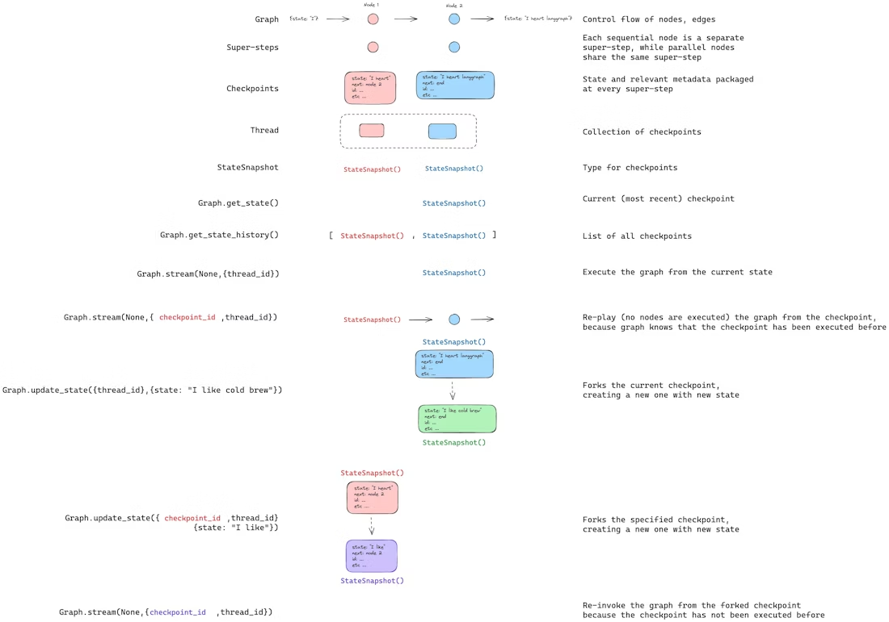

# LangGraph Tutorial

Step-by-step notebooks covering LangChain agents through advanced LangGraph memory patterns.

## Notebooks

| Notebook | Topics |
|----------|--------|
| `01-langchain-create-agent` | LangChain basics: models, messages, tools, `create_agent` |
| `02-langgraph-basic` | Build a ReACT agent from scratch: state, nodes, edges, `ToolNode` |
| `03-langgraph-complex-lt-memory` | Short-term memory (checkpointers), interrupts (HITL), long-term memory (stores), semantic search, streaming |

## Running

```bash
cd langgraph-tutorial
pip install -r ../requirements.txt
```

Set `OPENAI_API_KEY` in your `.env` file, then run notebooks in order.

## 👨‍💻 What is LangGraph
- LangGraph is a framework for orchestrating AI agents as graphs of nodes, letting you control step-by-step flow, add tools, plug in memory, handle failures, and add human-in-the-loop.
